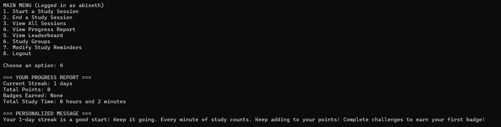

# StudySpark 📚

## Overview
StudySpark is a CLI-based study assistant that helps users track their study sessions, monitor progress, earn badges, and stay motivated with AI-generated encouragement. Data is stored in a MySQL database for simplicity and portability.

## Features 🚀
- **User Registration & Authentication**
- **Start & End Study Sessions**
- **Track Study Progress**
  - Total study time
  - Current streak
  - Points & badges earned
- **AI Motivational Messages**
- **Leaderboard**
- **Study Groups & Resources**
- **Custom Study Reminders**

## Installation ⚙️
1. Clone the repository:
   ```bash
   git clone https://github.com/Abi-Seth/STUDYSPARK_PLP-2_C3_Group3.git
   cd studyspark
   ```
2. Run the application:
   ```bash
   python main.py
   ```

## Usage 🏁
1. Register or log in.
2. Start a study session by specifying the duration.
3. Receive an AI-generated motivational message.
4. View your study progress and leaderboard rankings.
5. Join or create study groups and share resources.

## Data Storage 📂
StudySpark uses MYSQL to store user data, sessions, and progress, ensuring ease of access and portability.

## Screenshots 📸





## Contributors 🤝
- **Gloria** - Registration & Authentication
- **Denyse** - Study Sessions
- **Rwema** - Session Tracking
- **Seth** - Progress Reports
- **Kate** - Leaderboard
- **Tresor** - Study Groups
- **Israel** - Study Resources
- **Team** - Study Reminders

## Future Enhancements 🔮
- **Cloud-based data storage**
- **Mobile App Integration**
- **Advanced AI-powered study suggestions**
